<h1>Table of Contents<span class="tocSkip"></span></h1>
<div class="toc"><ul class="toc-item"><li><span><a href="#EDA" data-toc-modified-id="EDA-1"><span class="toc-item-num">1&nbsp;&nbsp;</span>EDA</a></span></li><li><span><a href="#Model" data-toc-modified-id="Model-2"><span class="toc-item-num">2&nbsp;&nbsp;</span>Model</a></span><ul class="toc-item"><li><ul class="toc-item"><li><span><a href="#RFE" data-toc-modified-id="RFE-2.0.1"><span class="toc-item-num">2.0.1&nbsp;&nbsp;</span>RFE</a></span></li><li><span><a href="#grid-search" data-toc-modified-id="grid-search-2.0.2"><span class="toc-item-num">2.0.2&nbsp;&nbsp;</span>grid search</a></span></li></ul></li><li><span><a href="#feature-importance" data-toc-modified-id="feature-importance-2.1"><span class="toc-item-num">2.1&nbsp;&nbsp;</span>feature importance</a></span></li><li><span><a href="#confusion-matrix" data-toc-modified-id="confusion-matrix-2.2"><span class="toc-item-num">2.2&nbsp;&nbsp;</span>confusion matrix</a></span></li><li><span><a href="#ROC-curve" data-toc-modified-id="ROC-curve-2.3"><span class="toc-item-num">2.3&nbsp;&nbsp;</span>ROC curve</a></span></li><li><span><a href="#Probability-dist" data-toc-modified-id="Probability-dist-2.4"><span class="toc-item-num">2.4&nbsp;&nbsp;</span>Probability dist</a></span></li><li><span><a href="#Interpretability" data-toc-modified-id="Interpretability-2.5"><span class="toc-item-num">2.5&nbsp;&nbsp;</span>Interpretability</a></span></li><li><span><a href="#PCA" data-toc-modified-id="PCA-2.6"><span class="toc-item-num">2.6&nbsp;&nbsp;</span>PCA</a></span></li></ul></li></ul></div>


```python
import matplotlib.pyplot as plt
plt.style.use('gadfly')
import seaborn as sns
import pandas as pd
import numpy as np
import shap

from tqdm import tqdm_notebook as tqdm

from sklearn.datasets import load_breast_cancer
from sklearn.ensemble import RandomForestClassifier
from sklearn.model_selection import train_test_split, cross_val_score, GridSearchCV
from sklearn.metrics import confusion_matrix, classification_report, auc, roc_curve
from sklearn.decomposition import PCA
from sklearn.preprocessing import StandardScaler
from sklearn.feature_selection import RFE
from sklearn.pipeline import Pipeline
```


```python
data = load_breast_cancer()

df = pd.DataFrame(data.data, columns=data.feature_names)
df['target'] = data.target
```


```python
df.shape
```


    (569, 31)


# EDA


```python
def cols_eda(df): 
    eda_df = {}
    eda_df['null_sum'] = df.isnull().sum()
    eda_df['null_%'] = df.isnull().mean()
    eda_df['dtypes'] = df.dtypes
    eda_df['count'] = df.count()
    eda_df['mean'] = df.mean()
    eda_df['median'] = df.median()
    eda_df['min'] = df.min()
    eda_df['max'] = df.max()
    return pd.DataFrame(eda_df)
```


```python
cols_eda(df)
```


<table border="1" class="dataframe">
  <thead>
    <tr style="text-align: right;">
      <th></th>
      <th>count</th>
      <th>dtypes</th>
      <th>max</th>
      <th>mean</th>
      <th>median</th>
      <th>min</th>
      <th>null_%</th>
      <th>null_sum</th>
    </tr>
  </thead>
  <tbody>
    <tr>
      <th>mean radius</th>
      <td>569</td>
      <td>float64</td>
      <td>28.11000</td>
      <td>14.127292</td>
      <td>13.370000</td>
      <td>6.981000</td>
      <td>0.0</td>
      <td>0</td>
    </tr>
    <tr>
      <th>mean texture</th>
      <td>569</td>
      <td>float64</td>
      <td>39.28000</td>
      <td>19.289649</td>
      <td>18.840000</td>
      <td>9.710000</td>
      <td>0.0</td>
      <td>0</td>
    </tr>
    <tr>
      <th>mean perimeter</th>
      <td>569</td>
      <td>float64</td>
      <td>188.50000</td>
      <td>91.969033</td>
      <td>86.240000</td>
      <td>43.790000</td>
      <td>0.0</td>
      <td>0</td>
    </tr>
    <tr>
      <th>mean area</th>
      <td>569</td>
      <td>float64</td>
      <td>2501.00000</td>
      <td>654.889104</td>
      <td>551.100000</td>
      <td>143.500000</td>
      <td>0.0</td>
      <td>0</td>
    </tr>
    <tr>
      <th>mean smoothness</th>
      <td>569</td>
      <td>float64</td>
      <td>0.16340</td>
      <td>0.096360</td>
      <td>0.095870</td>
      <td>0.052630</td>
      <td>0.0</td>
      <td>0</td>
    </tr>
    <tr>
      <th>mean compactness</th>
      <td>569</td>
      <td>float64</td>
      <td>0.34540</td>
      <td>0.104341</td>
      <td>0.092630</td>
      <td>0.019380</td>
      <td>0.0</td>
      <td>0</td>
    </tr>
    <tr>
      <th>mean concavity</th>
      <td>569</td>
      <td>float64</td>
      <td>0.42680</td>
      <td>0.088799</td>
      <td>0.061540</td>
      <td>0.000000</td>
      <td>0.0</td>
      <td>0</td>
    </tr>
    <tr>
      <th>mean concave points</th>
      <td>569</td>
      <td>float64</td>
      <td>0.20120</td>
      <td>0.048919</td>
      <td>0.033500</td>
      <td>0.000000</td>
      <td>0.0</td>
      <td>0</td>
    </tr>
    <tr>
      <th>mean symmetry</th>
      <td>569</td>
      <td>float64</td>
      <td>0.30400</td>
      <td>0.181162</td>
      <td>0.179200</td>
      <td>0.106000</td>
      <td>0.0</td>
      <td>0</td>
    </tr>
    <tr>
      <th>mean fractal dimension</th>
      <td>569</td>
      <td>float64</td>
      <td>0.09744</td>
      <td>0.062798</td>
      <td>0.061540</td>
      <td>0.049960</td>
      <td>0.0</td>
      <td>0</td>
    </tr>
    <tr>
      <th>radius error</th>
      <td>569</td>
      <td>float64</td>
      <td>2.87300</td>
      <td>0.405172</td>
      <td>0.324200</td>
      <td>0.111500</td>
      <td>0.0</td>
      <td>0</td>
    </tr>
    <tr>
      <th>texture error</th>
      <td>569</td>
      <td>float64</td>
      <td>4.88500</td>
      <td>1.216853</td>
      <td>1.108000</td>
      <td>0.360200</td>
      <td>0.0</td>
      <td>0</td>
    </tr>
    <tr>
      <th>perimeter error</th>
      <td>569</td>
      <td>float64</td>
      <td>21.98000</td>
      <td>2.866059</td>
      <td>2.287000</td>
      <td>0.757000</td>
      <td>0.0</td>
      <td>0</td>
    </tr>
    <tr>
      <th>area error</th>
      <td>569</td>
      <td>float64</td>
      <td>542.20000</td>
      <td>40.337079</td>
      <td>24.530000</td>
      <td>6.802000</td>
      <td>0.0</td>
      <td>0</td>
    </tr>
    <tr>
      <th>smoothness error</th>
      <td>569</td>
      <td>float64</td>
      <td>0.03113</td>
      <td>0.007041</td>
      <td>0.006380</td>
      <td>0.001713</td>
      <td>0.0</td>
      <td>0</td>
    </tr>
    <tr>
      <th>compactness error</th>
      <td>569</td>
      <td>float64</td>
      <td>0.13540</td>
      <td>0.025478</td>
      <td>0.020450</td>
      <td>0.002252</td>
      <td>0.0</td>
      <td>0</td>
    </tr>
    <tr>
      <th>concavity error</th>
      <td>569</td>
      <td>float64</td>
      <td>0.39600</td>
      <td>0.031894</td>
      <td>0.025890</td>
      <td>0.000000</td>
      <td>0.0</td>
      <td>0</td>
    </tr>
    <tr>
      <th>concave points error</th>
      <td>569</td>
      <td>float64</td>
      <td>0.05279</td>
      <td>0.011796</td>
      <td>0.010930</td>
      <td>0.000000</td>
      <td>0.0</td>
      <td>0</td>
    </tr>
    <tr>
      <th>symmetry error</th>
      <td>569</td>
      <td>float64</td>
      <td>0.07895</td>
      <td>0.020542</td>
      <td>0.018730</td>
      <td>0.007882</td>
      <td>0.0</td>
      <td>0</td>
    </tr>
    <tr>
      <th>fractal dimension error</th>
      <td>569</td>
      <td>float64</td>
      <td>0.02984</td>
      <td>0.003795</td>
      <td>0.003187</td>
      <td>0.000895</td>
      <td>0.0</td>
      <td>0</td>
    </tr>
    <tr>
      <th>worst radius</th>
      <td>569</td>
      <td>float64</td>
      <td>36.04000</td>
      <td>16.269190</td>
      <td>14.970000</td>
      <td>7.930000</td>
      <td>0.0</td>
      <td>0</td>
    </tr>
    <tr>
      <th>worst texture</th>
      <td>569</td>
      <td>float64</td>
      <td>49.54000</td>
      <td>25.677223</td>
      <td>25.410000</td>
      <td>12.020000</td>
      <td>0.0</td>
      <td>0</td>
    </tr>
    <tr>
      <th>worst perimeter</th>
      <td>569</td>
      <td>float64</td>
      <td>251.20000</td>
      <td>107.261213</td>
      <td>97.660000</td>
      <td>50.410000</td>
      <td>0.0</td>
      <td>0</td>
    </tr>
    <tr>
      <th>worst area</th>
      <td>569</td>
      <td>float64</td>
      <td>4254.00000</td>
      <td>880.583128</td>
      <td>686.500000</td>
      <td>185.200000</td>
      <td>0.0</td>
      <td>0</td>
    </tr>
    <tr>
      <th>worst smoothness</th>
      <td>569</td>
      <td>float64</td>
      <td>0.22260</td>
      <td>0.132369</td>
      <td>0.131300</td>
      <td>0.071170</td>
      <td>0.0</td>
      <td>0</td>
    </tr>
    <tr>
      <th>worst compactness</th>
      <td>569</td>
      <td>float64</td>
      <td>1.05800</td>
      <td>0.254265</td>
      <td>0.211900</td>
      <td>0.027290</td>
      <td>0.0</td>
      <td>0</td>
    </tr>
    <tr>
      <th>worst concavity</th>
      <td>569</td>
      <td>float64</td>
      <td>1.25200</td>
      <td>0.272188</td>
      <td>0.226700</td>
      <td>0.000000</td>
      <td>0.0</td>
      <td>0</td>
    </tr>
    <tr>
      <th>worst concave points</th>
      <td>569</td>
      <td>float64</td>
      <td>0.29100</td>
      <td>0.114606</td>
      <td>0.099930</td>
      <td>0.000000</td>
      <td>0.0</td>
      <td>0</td>
    </tr>
    <tr>
      <th>worst symmetry</th>
      <td>569</td>
      <td>float64</td>
      <td>0.66380</td>
      <td>0.290076</td>
      <td>0.282200</td>
      <td>0.156500</td>
      <td>0.0</td>
      <td>0</td>
    </tr>
    <tr>
      <th>worst fractal dimension</th>
      <td>569</td>
      <td>float64</td>
      <td>0.20750</td>
      <td>0.083946</td>
      <td>0.080040</td>
      <td>0.055040</td>
      <td>0.0</td>
      <td>0</td>
    </tr>
    <tr>
      <th>target</th>
      <td>569</td>
      <td>int32</td>
      <td>1.00000</td>
      <td>0.627417</td>
      <td>1.000000</td>
      <td>0.000000</td>
      <td>0.0</td>
      <td>0</td>
    </tr>
  </tbody>
</table>
</div>


```python
sns.countplot('target', data=df)
```


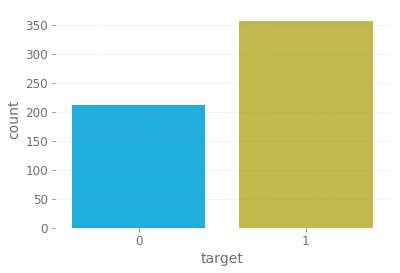


```python
corr = df.corr()
mask = np.triu(np.ones_like(corr, dtype=np.bool)) # mask to have just a triangular matrix
f, ax = plt.subplots(figsize=(13, 10))
cmap = sns.diverging_palette(250, 9, as_cmap=True)
sns.heatmap(corr, mask=mask, cmap=cmap, vmin=-0.7, vmax=0.7, center=0,
            square=True, annot=False, linewidths=.5, cbar_kws={"shrink": .5});
```


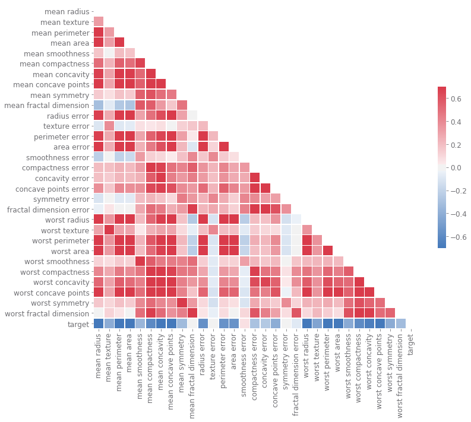


```python
correlations = df.corrwith(df['target']).iloc[:-1].to_frame() # you should have features only and label as last column in df
correlations['abs'] = correlations[0].abs()
sorted_correlations = correlations.sort_values('abs', ascending=False)[0]
fig, ax = plt.subplots(figsize=(6,10))
sns.heatmap(sorted_correlations[:15].to_frame(), cmap='coolwarm', annot=True, vmin=-0.75, vmax=0.75, ax=ax);
```


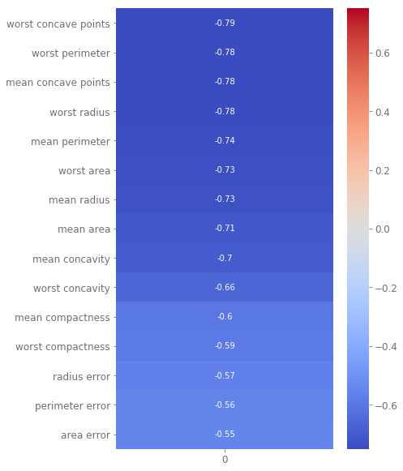


```python
fig, axes = plt.subplots(3, 3, figsize=(12, 12)) # this is for 9 plots
for i, col in enumerate(sorted_correlations.index[:9]):
    sns.distplot(df[df['target']==0][col], label='0', ax=axes[i//3][i%3])
    sns.distplot(df[df['target']==1][col], label='1', ax=axes[i//3][i%3])
plt.legend()
plt.tight_layout()
```


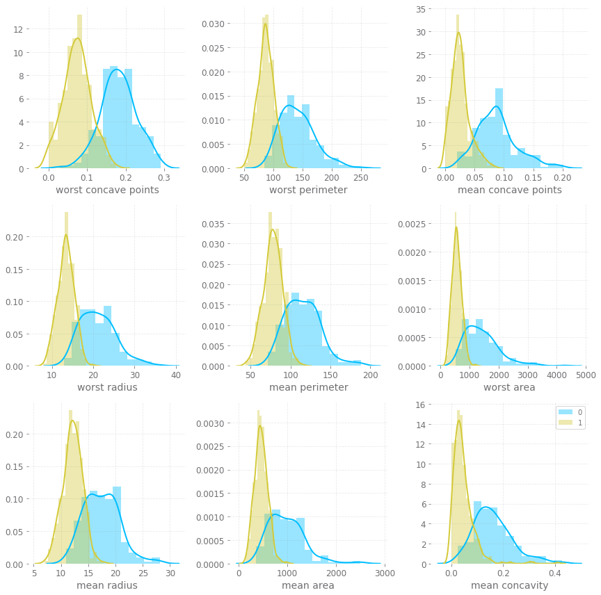


```python
sns.jointplot(df.loc[:,'worst concavity'], df.loc[:,'worst concave points'], kind="reg");
```


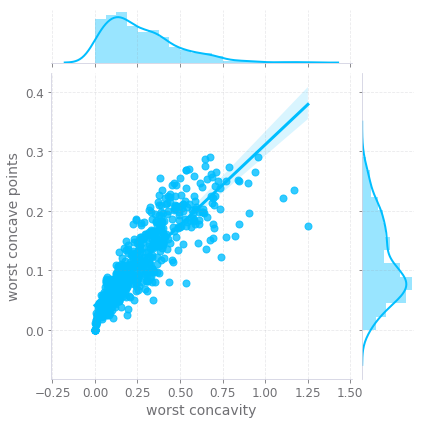


# Model


```python
X = df.drop('target', axis=1)
y = df['target']
X_train, X_test, y_train, y_test = train_test_split(X, y, test_size=0.2, random_state=42)
```


```python
forest = RandomForestClassifier(oob_score=True, random_state=42)
forest.fit(X_train, y_train)

print(f'training accuracy: {forest.score(X_train, y_train)}')
print(f'oob score: {forest.oob_score_}')
print(f'10-fold cross validation score: {np.mean(cross_val_score(forest, X_train, y_train, cv=10))}')

print(f'test accuracy: {forest.score(X_test, y_test)}')
y_pred = forest.predict(X_test)
pred_probs = forest.predict_proba(X_test)[:, 1]
```

    training accuracy: 1.0
    oob score: 0.9560439560439561
    10-fold cross validation score: 0.9626086956521739
    test accuracy: 0.9649122807017544
    

### RFE


```python
forest_rfe = RandomForestClassifier(oob_score=True, random_state=42)

rfe = RFE(forest_rfe, n_features_to_select=8, step=2, verbose=1)
pipeline = Pipeline([('feature selection', rfe), ('classification', forest_rfe)])
pipeline.fit(X_train, y_train)

core_features = [i[1] for i in zip(pipeline['feature selection'].support_, X_train.columns) if i[0]]

print(f'test accuracy: {pipeline["classification"].score(X_test[core_features], y_test)}')
```

    Fitting estimator with 30 features.
    Fitting estimator with 28 features.
    Fitting estimator with 26 features.
    Fitting estimator with 24 features.
    Fitting estimator with 22 features.
    Fitting estimator with 20 features.
    Fitting estimator with 18 features.
    Fitting estimator with 16 features.
    Fitting estimator with 14 features.
    Fitting estimator with 12 features.
    Fitting estimator with 10 features.
    test accuracy: 0.956140350877193
    

### grid search


```python
param_grid = {
                 'n_estimators': [5, 10, 15, 20],
                 'max_depth': [2, 5, 7, 9]
             }

forest_gs = GridSearchCV(RandomForestClassifier(random_state=42), param_grid, cv=10)
forest_gs.fit(X_train, y_train)

print(f'training accuracy: {forest_gs.score(X_train, y_train)}')
print(f'10-fold cross validation score: {np.mean(forest_gs.cv_results_["mean_test_score"])}')
print(f'test accuracy: {forest_gs.score(X_test, y_test)}')
y_pred = forest_gs.predict(X_test)
pred_probs = forest_gs.predict_proba(X_test)[:, 1]
```

    training accuracy: 1.0
    10-fold cross validation score: 0.9495712560386473
    test accuracy: 0.9649122807017544
    

## feature importance


```python
def plot_feature_importance(df, forest, n):
    features = df.columns
    importances = forest.feature_importances_
    indices = np.argsort(importances)[::-1]
    
    fig = plt.figure(figsize=(8,6))
    plt.bar(np.arange(0,n,1), importances[indices[:n]], align='center', width=.5, alpha=.5, linewidth=1.0, edgecolor='k',
           label='individual feature importance')
    plt.step(np.arange(0,n,1), np.cumsum(importances[indices[:n]]), where='mid', label='cumulative feature importance')
    plt.xticks(np.arange(0,n,1), features[indices[:n]], rotation=90)
    plt.ylabel('Importance')
    plt.legend(loc='best')
    
plot_feature_importance(X_train, forest, 8)
```


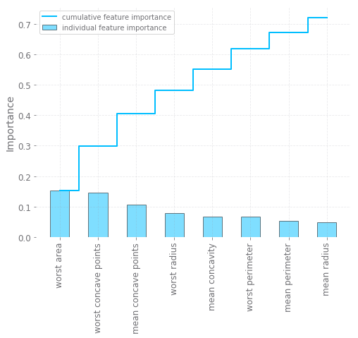


## confusion matrix


```python
def plot_confmat(y_true, y_pred):
    confmat = confusion_matrix(y_test, y_pred)
    plt.figure(figsize=(5,5))
    ax = sns.heatmap(confmat, annot=True, annot_kws={'size':20}, fmt=".0f", 
                linewidths=.5, square = True, cmap = 'Blues', cbar_kws={"shrink": .5})
    plt.ylabel('True label', size=20)
    plt.xlabel('Predicted label', size=20)
    plt.tick_params(axis='both', labelsize=20)
    cbar = ax.collections[0].colorbar
    cbar.ax.tick_params(labelsize=20)
    plt.text(3, 1.5, classification_report(y_true, y_pred, target_names=['Malignant [0]', 'Benign [1]']), size=15)
    
plot_confmat(y_test, y_pred)
```


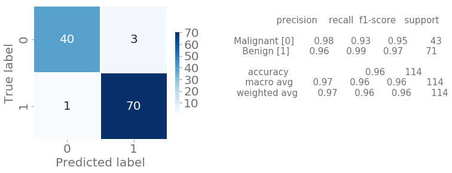


## ROC curve


```python
def plot_ROC_curve(y_true, pred_probs):
        fig = plt.figure(figsize=(8,8))
        fpr, tpr, thresholds = roc_curve(y_true, pred_probs, pos_label=1)
        roc_auc = auc(fpr, tpr)
        plt.plot(fpr, tpr, linewidth=2, label=f'ROC (area= %.2f)' % roc_auc)
        plt.plot([0, 1], [0, 1], linestyle='--', linewidth=3, color=(0.6, 0.6, 0.6), label='random guessing')
        plt.plot([0, 0, 1], [0, 1, 1], linestyle=':', linewidth=3, color='k', label='perfect performance')
        plt.xlim([-0.05, 1.05])
        plt.ylim([-0.05, 1.05])
        plt.xlabel('false positive rate', size=20)
        plt.ylabel('true positive rate', size=20)
        plt.legend(loc="lower right", fontsize=20)
        
plot_ROC_curve(y_test, pred_probs)
```


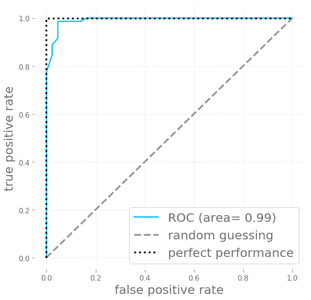


## Probability dist


```python
def plot_probs(probs0, probs1):
        fig = plt.figure(figsize=(10,6))
        sns.distplot(probs0, hist=False, kde_kws={"shade": True}, label='Malignant')
        sns.distplot(probs1, hist=False, kde_kws={"shade": True}, label='Benign')
        plt.xlabel('Probability of success', size=20)
        plt.legend(loc='best', fontsize=15)
        plt.xlim([0.0, 1])
        
df_probs = pd.DataFrame({'y_true':y_test.values, 'probs':pred_probs})
probs0 = df_probs[df_probs.y_true==0].probs
probs1 = df_probs[df_probs.y_true==1].probs
plot_probs(probs0, probs1)
```


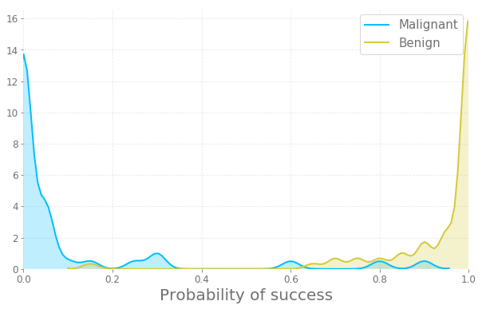


## Interpretability


```python
def summary_plot(trained_model, X_train):
    plt.figure(figsize=(6,6))
    explainer = shap.TreeExplainer(trained_model)
    shap_values = explainer.shap_values(X_train)
    shap.summary_plot(shap_values[1], X_train, show=True)
    
summary_plot(forest, X_train)
```

    Setting feature_perturbation = "tree_path_dependent" because no background data was given.
    


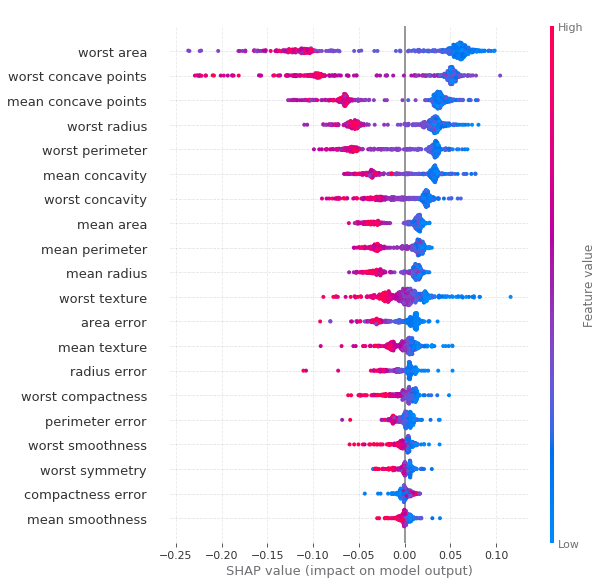


```python
def shap_plot_(trained_model, X_train, index, label):
#     plt.clf()
    explainer = shap.TreeExplainer(trained_model)
    shap_values = explainer.shap_values(X_train)
    # load JS visualization code to notebook
    shap.initjs()
    shap.force_plot(explainer.expected_value[label], shap_values[label][index], X_train.iloc[index,:], matplotlib=True, show=False)
    
shap_plot_(forest, X_train, index=3, label=1)
```

   


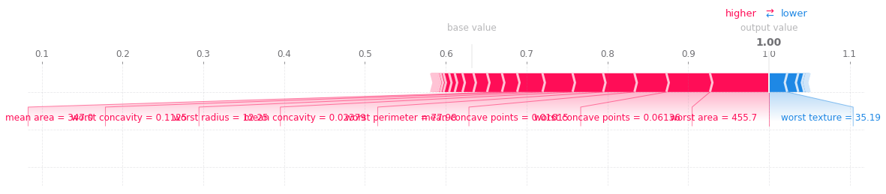


## PCA


```python
sc = StandardScaler()
pca = PCA(n_components=8)
X_train_std = sc.fit_transform(X_train)
X_train_pca = pca.fit_transform(X_train_std)
X_test_std = sc.fit_transform(X_test)
X_test_pca = pca.fit_transform(X_test_std)

forest = RandomForestClassifier(oob_score=True, random_state=42)
forest.fit(X_train_pca, y_train)

print(f'training accuracy: {forest.score(X_train_pca, y_train)}')
print(f'oob score: {forest.oob_score_}')

print(f'test accuracy: {forest.score(X_test_pca, y_test)}')
```

    training accuracy: 1.0
    oob score: 0.9604395604395605
    test accuracy: 0.9473684210526315
    
